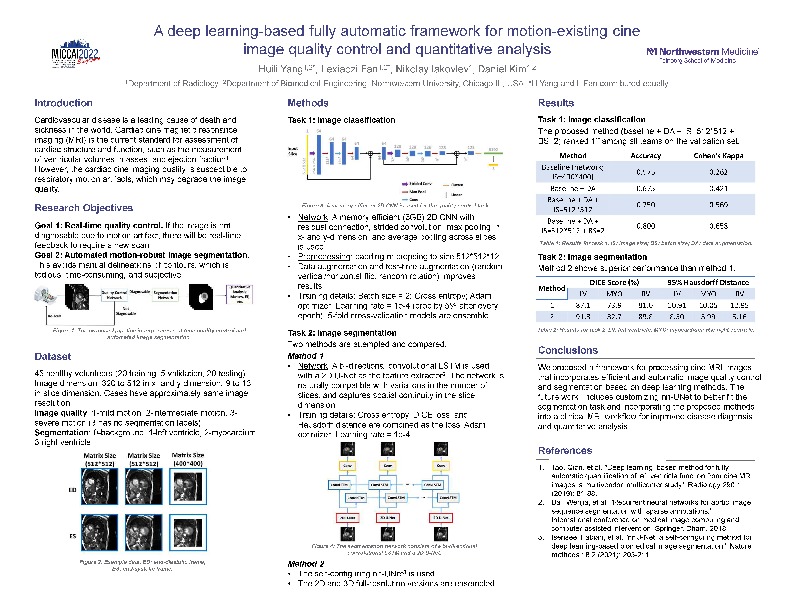

## Introduction
This is the official code submitted to the CMRxMotion challenge by Team CMR.Love.LHND. 
It's also the Final Dockerfile submitted to MICCAI 2022 [CMRxMotion Challenge](http://cmr.miccai.cloud/)

<!-- arxiv Version with the GitHub code link in the paper:
[]()

Springer Version without GitHub code link in the paper:
[]() -->


## Datasets
CMRxMotion Dataset: [http://cmr.miccai.cloud/data/](http://cmr.miccai.cloud/data/)

## Methodology and Poster Overview
<!--  -->


## Usage
This repository has been made publicly available with the consent of Team CMR.Love.LHND under the Apache 2.0 License.

## Citation
If this code is useful for your research, please consider citing:

```
@InProceedings{10.1007/978-3-031-23443-9_48,
author="Yang, Huili
and Fan, Lexiaozi
and Iakovlev, Nikolay
and Kim, Daniel",
editor="Camara, Oscar
and Puyol-Ant{\'o}n, Esther
and Qin, Chen
and Sermesant, Maxime
and Suinesiaputra, Avan
and Wang, Shuo
and Young, Alistair",
title="A Deep Learning-Based Fully Automatic Framework for Motion-Existing Cine Image Quality Control and Quantitative Analysis",
booktitle="Statistical Atlases and Computational Models of the Heart. Regular and CMRxMotion Challenge Papers",
year="2022",
publisher="Springer Nature Switzerland",
address="Cham",
pages="505--512",
abstract="Cardiac cine magnetic resonance imaging (MRI) is the current standard for the assessment of cardiac structure and function. In patients with dyspnea, however, the inability to perform breath-holding may cause image artifacts due to respiratory motion and degrade the image quality, which may result in incorrect disease diagnosis and downstream analysis. Therefore, quality control is an essential component of the clinical workflow. The accuracy of quantitative metrics such as left ventricular ejection fraction and volumes depends on the segmentation of the left ventricle (LV), myocardium (MYO), and right ventricle (RV). The current clinical practice involves manual segmentation, which is both time-consuming and subjective. Therefore, the development of a pipeline that incorporates efficient and automatic image quality control and segmentation is desirable. In this work, we developed a deep learning-based fully automated framework to first assess the image quality of acquired data, produce real-time feedback to determine whether a new acquisition is necessary or not when the patient is still on the table, and segment the LV, MYO, and RV. Specifically, we leverage a 2D CNN, incorporating some basic techniques to achieve both top performance and memory efficiency (within 3 GB) for the quality control task and nnU-Net framework for top performance for the segmentation task. We evaluated our method in the CMRxMotion challenge, ranking first place for the quality control task on the validation set and second place for the segmentation on the testing set among all the competing teams.",
isbn="978-3-031-23443-9"
}


```
